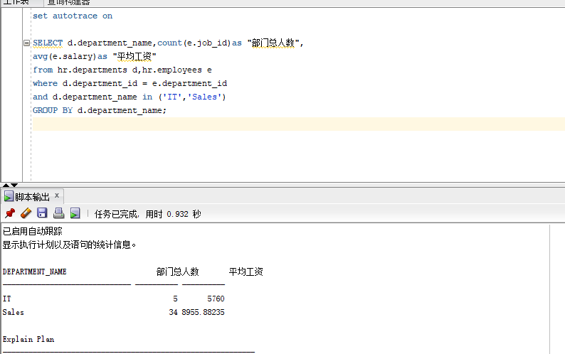

## 实验1：SQL语句的执行计划分析与优化指导
### 王年发    201810414318     软工18-3

### 实验目的
 - 对Oracle12c中的HR人力资源管理系统中的表进行查询与分析。
 - 首先运行和分析教材中的样例：本训练任务目的是查询两个部门('IT'和'Sales')的部门总人数和平均工资，以下两个查询的结果是一样的。但效率不相同。
 - 设计自己的查询语句，并作相应的分析，查询语句不能太简单。
### 查询语句
#### 查询1：
```
set autotrace on

SELECT d.department_name,count(e.job_id)as "部门总人数",
avg(e.salary)as "平均工资"
from hr.departments d,hr.employees e
where d.department_id = e.department_id
and d.department_name in ('IT','Sales')
GROUP BY d.department_name;
```

#### 查询2：
```
set autotrace on

SELECT d.department_name,count(e.job_id)as "部门总人数",
avg(e.salary)as "平均工资"
FROM hr.departments d,hr.employees e
WHERE d.department_id = e.department_id
GROUP BY d.department_name
HAVING d.department_name in ('IT','Sales');
```
#### 运行结果1

#### 运行结果2


#### 执行上面两个比较复杂的返回相同查询结果数据集的SQL语句，通过分析SQL语句各自的执行计划，判断哪个SQL语句是最优的。最后将你认为最优的SQL语句通过sqldeveloper的优化指导工具进行优化指导，看看该工具有没有给出优化建议


#### 用户hr默认没有统计权限，运行上述命令时要报错：无法收集统计信息, 请确保用户具有正确的访问权限。统计信息功能要求向用户授予v_sesstat, v_$statname 和 v_$session 的选择权限。怎样解决？

#### 解决方法 赋予权限


### 自我设计查询语句
#### 查询工资10000元以上的雇员姓名、所在部门和工资
```
set autotrace on
SELECT first_name,last_name,d.department_name,
e.salary
FROM hr.employees e , hr.departments d
where e.department_id =d.department_id 
and e.salary>=10000
order by e.salary desc;
```


#### 优化指导
