## 实验6（期末考核） 基于Oracle的图书馆数据库设计 
### 王年发    201810414318     软工18-3
### 期末考核要求
```
自行设计一个信息系统的数据库项目，自拟某项目名称。
设计项目涉及的表及表空间使用方案。至少5张表和5万条数据，两个表空间。
设计权限及用户分配方案。至少两类角色，两个用户。
在数据库中建立一个程序包，在包中用PL/SQL语言设计一些存储过程和函数，实现比较复杂的业务逻辑，用模拟数据进行执行计划分析。
设计自动备份方案或则手工备份方案。
设计容灾方案。使用两台主机，通过DataGuard实现数据库整体的异地备份(可选)。
```


### 实验步骤

#### 1.表空间创建

```mysql
create or replace PACKAGE MyPack IS
  /*
  本实验以实验4为基础。
  包MyPack中有：
  一个函数:Get_SaleAmount(V_DEPARTMENT_ID NUMBER)，
  一个过程:Get_Employees(V_EMPLOYEE_ID NUMBER)
  */
  FUNCTION Get_SaleAmount(V_DEPARTMENT_ID NUMBER) RETURN NUMBER;
  PROCEDURE Get_Employees(V_EMPLOYEE_ID NUMBER);
END MyPack;
```

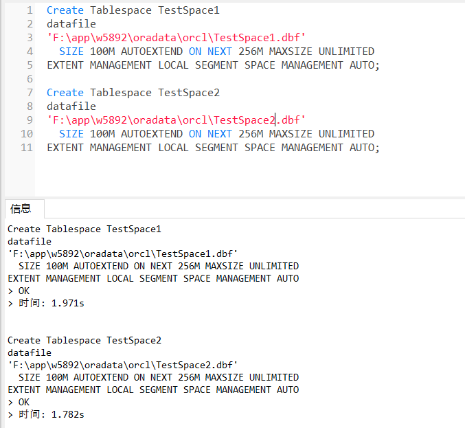

#### 2.创表
##### 2.1 reader表
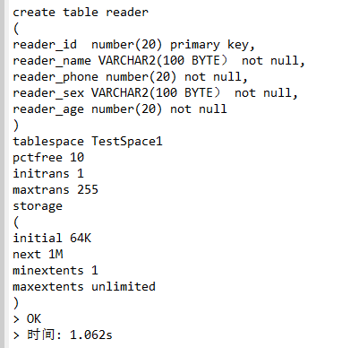
##### 2.2 book表
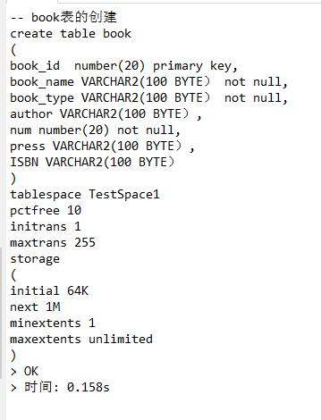
##### 2.3 admin表
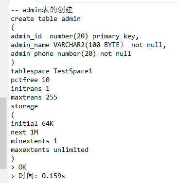
##### 2.4 orders表
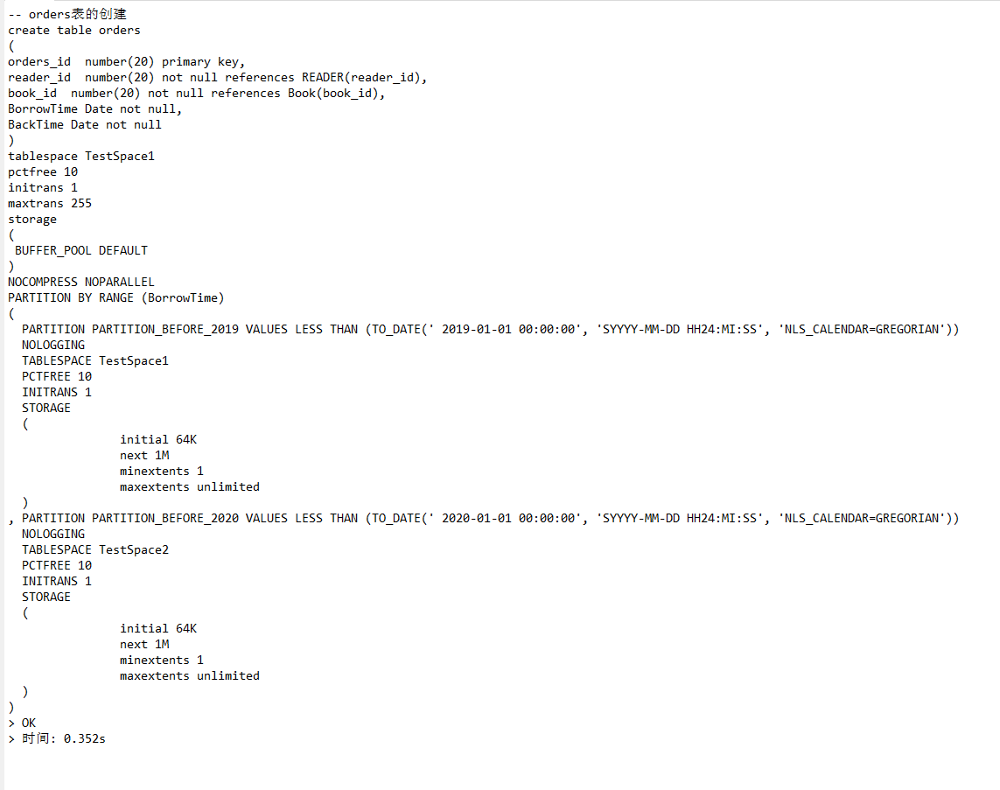
##### 2.5 logs表
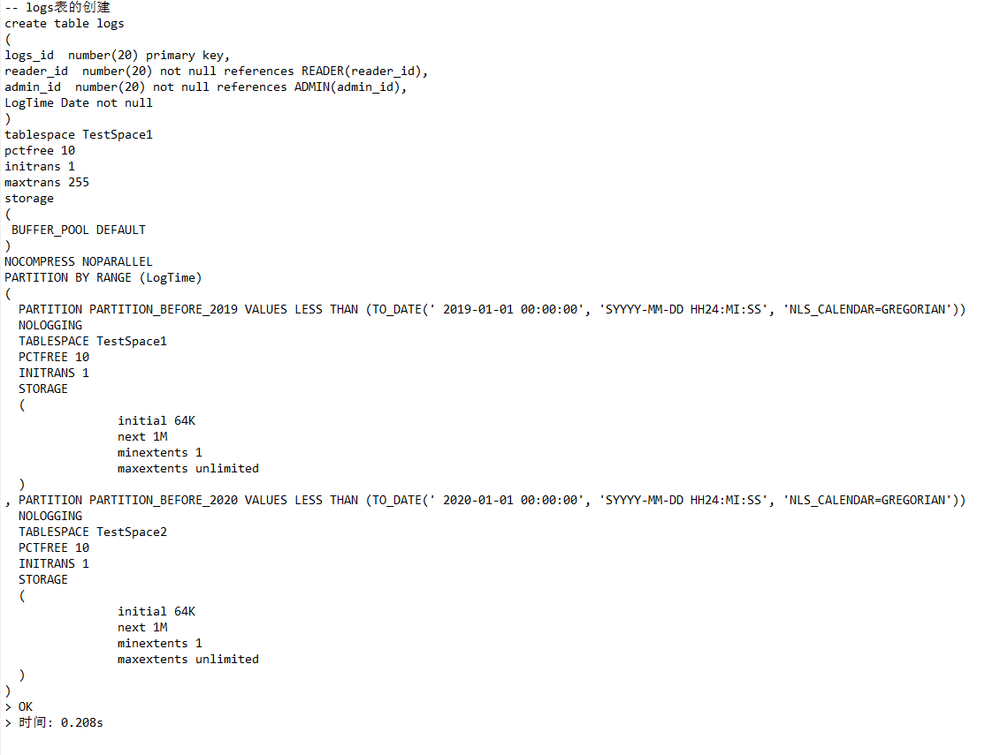
#### 3.数据插入
##### 3.1 book表数据插入
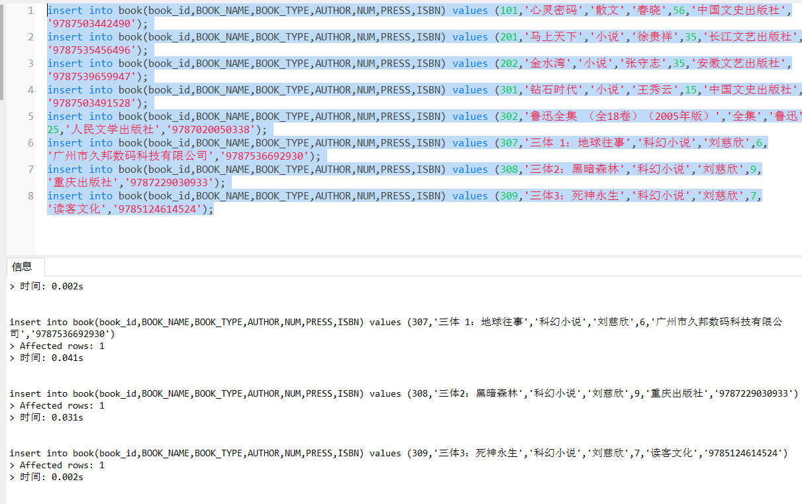
##### 3.2 reader表数据插入
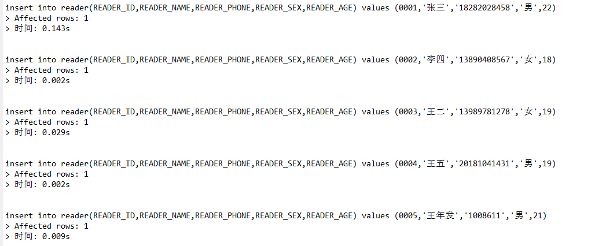
##### 3.3 admin表数据插入
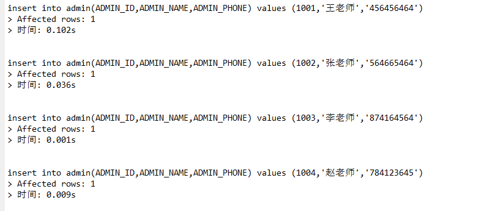
##### 3.4 orders表数据插入
```
declare 
i int;
orders_id  number(20);
reader_id  number(20);
book_id  number(20);
year int;
month int;
day int;
hour int;
minu int;
sec int;
DurTime VARCHAR2(100);
begin
i:=1;
while i<=30000 
loop
orders_id:=i;
select trunc(dbms_random.value(1,6))into reader_id FROM dual;
select trunc(dbms_random.value(201,209))into book_id FROM dual;
select trunc(dbms_random.value(2015,2018))into year FROM dual;
select trunc(dbms_random.value(1,12))into month FROM dual;
select trunc(dbms_random.value(1,28))into day FROM dual;
select trunc(dbms_random.value(1,24))into hour FROM dual;
select trunc(dbms_random.value(1,60))into minu FROM dual;
select trunc(dbms_random.value(1,60))into sec FROM dual;
select trunc(dbms_random.value(1,200))into durtime FROM dual;
insert into orders values (orders_id,reader_id,book_id,TO_DATE(year||'-'||month||'-'||day||' '||hour||':'||minu||':'||sec,'yyyy-mm-dd hh24:mi:ss'),durtime||'天');
i:=i+1;
end loop;
commit;
end;
```
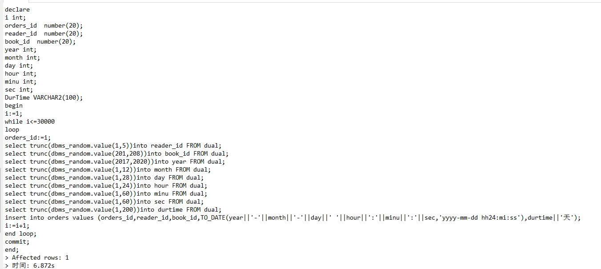
##### 3.5 logs表数据插入
```
declare 
i int;
logs_id  number(20);
reader_id  number(20);
admin_id  number(20);
year int;
month int;
day int;
hour int;
minu int;
sec int;

begin
i:=1;
while i<=20000 
loop
logs_id:=i;
select trunc(dbms_random.value(1,6))into reader_id FROM dual;
select trunc(dbms_random.value(1001,1005))into admin_id FROM dual;
select trunc(dbms_random.value(2015,2018))into year FROM dual;
select trunc(dbms_random.value(1,12))into month FROM dual;
select trunc(dbms_random.value(1,28))into day FROM dual;
select trunc(dbms_random.value(1,24))into hour FROM dual;
select trunc(dbms_random.value(1,60))into minu FROM dual;
select trunc(dbms_random.value(1,60))into sec FROM dual;
insert into LOGS values (logs_id,reader_id,admin_id,TO_DATE(year||'-'||month||'-'||day||' '||hour||':'||minu||':'||sec,'yyyy-mm-dd hh24:mi:ss'));
i:=i+1;
end loop;
commit;
end;
```
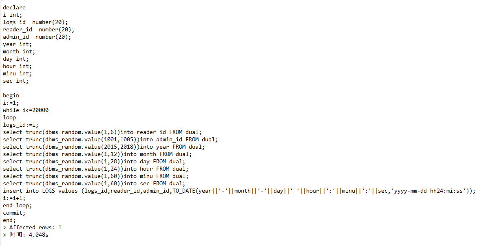
##### 4. 插入数据展示
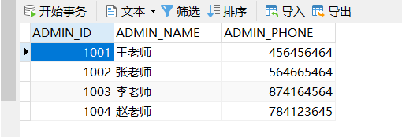
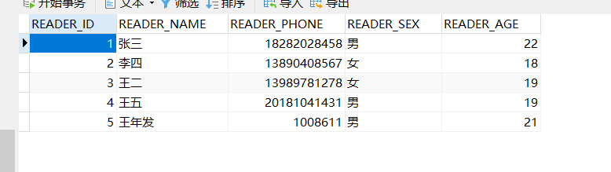
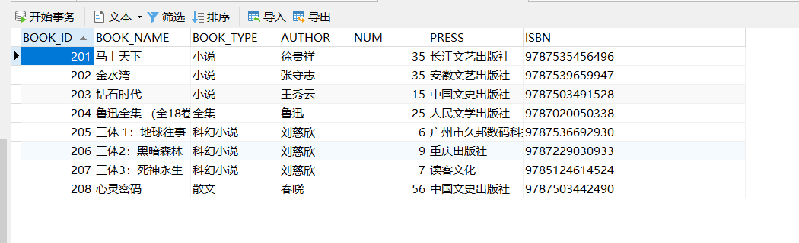
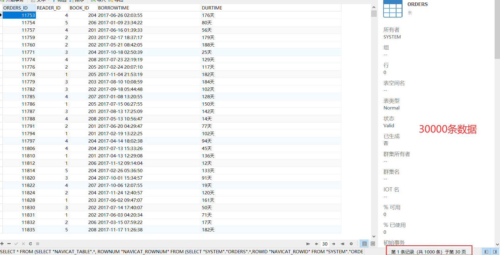
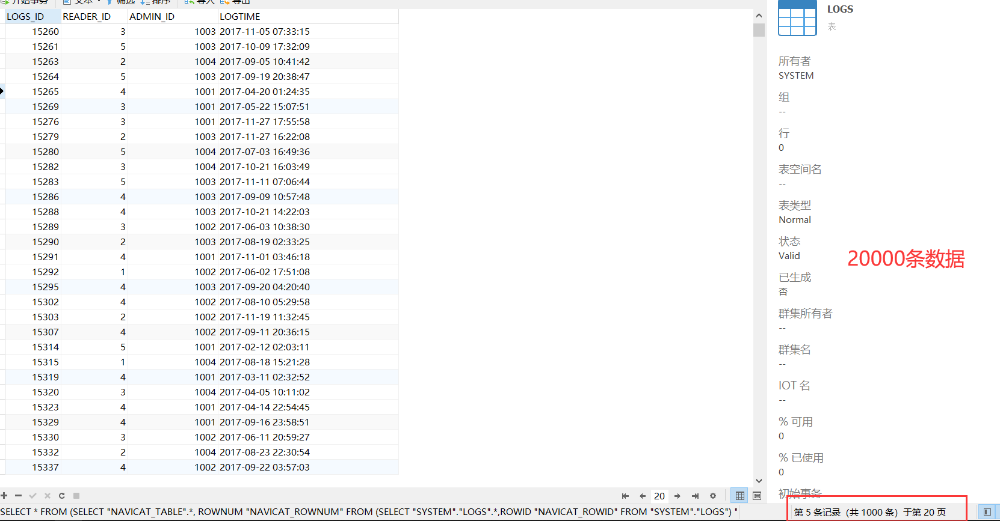

#### 5.创建角色和权限分配
```
create user test1 identified by test;
grant select on "Reader" to test1;
grant select on "Book" to test1;
grant select on "ORDERS" to test1;
grant select on "ADMIN" to test1;
grant select on "LOGS" to test1;
```
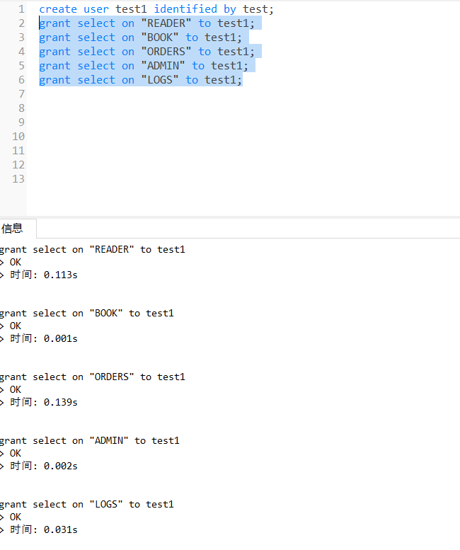
```
create user test2 identified by test;
grant connect, resource, dba to test2;
```
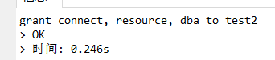

#### 6. 存储过程和函数
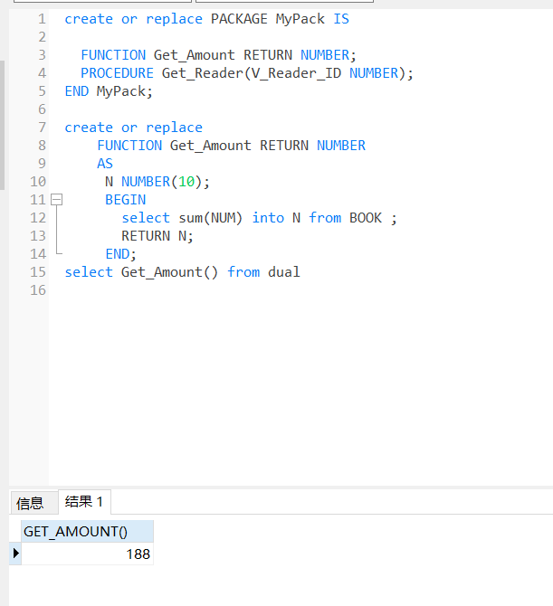
#### 7. 备份(windows下)
```
@echo off
set t_date=%date% 
set t_time=%time%
set t_n=%t_date:~0,4%
set t_y=%t_date:~5,2% 
set t_r=%t_date:~8,2% 
set t_h=%t_time:~0,2%
set t_m=%t_time:~3,2%
set full_name=CTEurope%t_y%%t_r%%t_h%%t_m%
exp eutest/1@gentle file=%full_name%.dmp1
"C:\Program Files\WinRAR\Rar.exe" a -k -r -s -m1 %full_name%.rar %full_name%.dmp
del %full_name%.dmp
```
然后将这个bat文件添加到windows的任务计划中，设置每隔多少时间运行一次，备份文件会自动以当前时间来保存并压缩。
注意：当用户名或者密码中，含有特殊字符时，需要用"""将其包含进来，这样才可以导出
### 项目总结
通过本次的实验，让我更加了解了oracle，把前面的几次试验结合起来，完成一个较大的项目。在这次的项目中，我设计的是图书管理系统，共5张表，插入了5w条数据，设计了两类角色，两个用户。在完成过程中，遇到一些难题，就比如在插入数据时，想要插入随机汉字，研究了很一会就还是不会，所以就只有在原基础上加数字然后叠加，这样插入的上万条数据。总的来说，还是很有收获的，希望下来能继续深入研究。